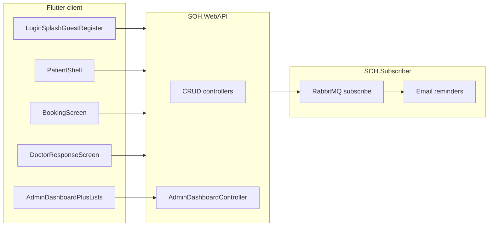

# Analysis: seminar document vs Stomatološka Ordinacija Hercegovina solution

_Source: gap review after the RSII 2025/26 cleanup + rubric compliance pass,
updated after the Phase 2 residuals pass (see
[`plan-phase-2-residuals-and-rubric.md`](plan-phase-2-residuals-and-rubric.md))._

**Status:** The cleanup pass closed the remaining rubric gaps. Online **PayPal
(sandbox) payment with refund** is now implemented end-to-end, the desktop
admin lists are **paginated + searchable** with **FK dropdowns**, reference
data (**services, rooms, genders**) has full **CRUD**, report PDFs can be
**printed**, the recommender now also scores **DetailOpened**, and the mobile
app gained a **global 401 handler**, **appointment/product detail screens**,
and friendlier error handling.

**Phase 2 (residuals) is now complete:** the patient appointment **cancel**
uses a dedicated ownership-checked endpoint (no more 403); **payment events
raise notifications** and the mobile list shows timestamps and auto-refreshes;
changing your **own password requires the current one**; **`GET /MedicalRecord`
and `GET /Patient`** are scoped by role/ownership; **`UserService` paging** is
clamped to the shared 100-row ceiling; **order totals are computed
server-side** with a mobile confirmation dialog; the **PayPal webhook signature
is verified** and refunds are idempotent; the desktop dead **Settings**
placeholder was removed; Docker images are **version-pinned**. The only
deliberately deferred items remain **collaborative filtering** and a full
**product checkout** (both framed as later/optional by the source document).

**Final rubric compliance (submission prep):** database name changed to student
ID `180202`; rubric-compliant test credentials added (`desktop`/`test`,
`mobile`/`test`, `doctor`/`test`); PayPal environment variables added to
`docker-compose.yml` for the API container; README updated with rubric-format
credentials table.

---

## 1. Document (Fakultet Informacijskih Tehnologija (1).docx) — substance

**Genre and purpose:** Seminar paper / theme proposal (“Restorante” header appears to be a template artifact) for **Razvoj softvera II**, dated **July 2024**, student **Haris Tirić**, mentors named. It frames a real problem in BH healthcare (queues, limited slots, weak communication), focuses on **stomatology**, and introduces the product **“Stomatološka Ordinacija Hercegovina”** as a platform for digital access.

**Stated goals:** Online booking, access to findings, visibility of procedures (extraction, check-ups, etc.), better organization, patient–clinic communication, shorter waiting.

**Functional requirements — end users (verbatim themes):**

- View **free appointment slots**; **book and cancel**; view **scheduled** and **historical** appointments.
- **Doctor:** add **findings and professional opinion**; **patient:** view them.
- **Payment via app** (PayPal narrative in mockup) — **implemented** (sandbox order/capture/refund).
- **Reviews and ratings** after service.
- **Doctor response** to booking requests: accepted/declined **with notes**.
- **Reminders** for check-ups and **oral hygiene** (mockup: days until next visit, daily brushing habit indicator, list of things to avoid).
- **Recommended oral-care products** (display and admin-side addition implied).

**Functional requirements — administration:** **View** and **edit** data (broad).

**Mockups / UX narrative (non-exhaustive but binding for “intended” product):**

- **Login:** welcome; login required for advanced features; **guest path** to browse **clinic locations only**.
- **Home:** welcome, **recommended products**, **“Zakaži Termin”** CTA, **dentist list** with short bios/ratings.
- **Booking:** pick **dentist**, **date**, then **hour/minute slots** for that day, **service type**, optional note; navigation back to day selection.
- **My appointments:** three lists — **upcoming** (Cancel, Nalazi), **completed** (Ocijeni, Nalazi), **cancelled** (read-only history).
- **Doctor screen:** review requests; accept/reject with context.
- **Rating screen:** visit summary + **stars** + written review.
- **Reminders screen:** rich **preventive/educational** UI as described above.
- **Admin (desktop):** KPIs (active users, doctors, clients, rooms; completed/cancelled counts; **average revenue**; new members in period), **charts** (appointments over time, financial flows, engagement), **quick actions** (add patients, manage all profile types, edit **office info** (locations, hours, contacts), manage appointments, **generate reports**), **recent activity log** with count indicator.
- **Recommendation system (design):** start with **content-based** filtering; later **collaborative** filtering as data grows.

**Data model (document):** Users, Patients, Doctors, Admins, Appointments, Services, Rooms, Reviews, Products, Orders, Reminders, Activity logs, Reports, Payment, Documents (findings, etc.). Note: diagram columns are examples; final DB may have more.

---

## 2. Solution in this repository — architecture and what exists

**Stack:** **ASP.NET Core Web API** (`backend/SOH.WebAPI`) with **EF Core** (`backend/SOH.Services/Database/SOHDbContext.cs`), **AutoMapper**, CRUD controllers for the main entities, plus **AdminDashboardController** (`/admin-dashboard/...`) for aggregated **stats**, **monthly appointments**, **revenue breakdown**, **doctor spotlight**, **recent activity**. **SOH.Subscriber** listens on **RabbitMQ** for **`AppointmentReminderMessage`** and can send **reminder emails** to configured recipients (`backend/SOH.Subscriber/Services/BackgroundWorkerService.cs`) — complements the in-app reminders/hygiene screen.

**Flutter app** (`app/lib`, current seminar-aligned client on **`feat/seminar-requirements-ui`**): Riverpod + OpenAPI (`soh_api`). **Auth & shell:** splash (with patient-profile check), login, **guest** city list, **register**, **complete patient profile**, **patient shell** (bottom nav: home, appointments, care, profile with logout / user edit). **Patient:** `HomeScreen` (welcome, **content-based** product strip, book CTA, dentists), `BookingScreen` (doctor → date → slots → service → confirm), **my appointments** (three tabs, cancel, findings, review), **reminders & hygiene** (next visit text, brushing log via HygieneTracker API, static avoid list), **patient findings** reader. **Doctor:** pending / upcoming / completed, accept–reject with note, medical record / findings on completed visits. **Admin:** dashboard stats/charts/recent activity; **quick actions** open **users** list (add/manage patients & staff via existing user UI), **office locations** (city list), **all appointments** list, **reports** list; settings action is still a placeholder snackbar.

**Backend vs document:** Entity set matches the paper’s list closely. After the
cleanup pass the schema was trimmed (dropped `DoctorNote`, `Admin`, the unused
`Reminder` CRUD, and `OrderItem`; `Order` now references a product directly).
**Payment** is now a real flow: `PaymentController` exposes PayPal sandbox
order / capture / refund / webhook endpoints backed by `PayPalGateway`
(`backend/SOH.Services/Services/PayPalGateway.cs`); the price always comes from
the service catalog server-side.

---

## 3. Coverage table (re-audit after cleanup pass)

| Topic | Status |
| --- | --- |
| Guest: clinic locations only | **Done** (`guest_locations_screen.dart`) |
| Registration / complete patient profile | **Done** (`register_screen.dart`, `complete_profile_screen.dart`) |
| Patient shell (navigation after login) | **Done** (`patient_shell_screen.dart`) |
| View free slots + book appointment | **Done** (`booking_screen.dart` + `booking_slots.dart` + providers) |
| Cancel appointment (patient) | **Done** (`POST /Appointment/{id}/cancel`, ownership + state machine) |
| My appointments (upcoming / completed / cancelled + actions) | **Done** (`my_appointments_screen.dart`) |
| Patient: view findings / documents | **Done** (`patient_findings_screen.dart`) |
| Doctor: add findings + opinion | **Done** |
| Doctor: accept/decline with notes | **Done** |
| Reviews and ratings (patient UI) | **Done** (`appointment_review_screen.dart`) |
| Recommended products (content + popularity + behavioral incl. DetailOpened) | **Done**; **collaborative** **Deferred** (doc phase 2) |
| Admin: dashboard KPIs + charts + recent activity | **Done** |
| Admin: paginated + searchable lists | **Done** (`PaginatedSearchView`, server caps page size at 100, FTS) |
| Admin: FK dropdowns + human-readable labels | **Done** (appointment create/edit, lookup providers) |
| Admin: reference-data CRUD (services, rooms, genders) | **Done** (validated add/edit dialogs + delete confirm) |
| Admin: per-field validators + discard-changes guard | **Done** |
| Reports from desktop (list + PDF + print) | **Done** (audit rows persisted, print via `printing`) |
| Reminders + hygiene mockup screen | **Done** in app (subscriber email remains env-driven) |
| Payment in app (PayPal sandbox) | **Done** (order/capture/refund; webhook signature verified when configured) |
| Payment notifications (patient) | **Done** (capture + refund; mobile list shows `createdAt`, auto-refresh) |
| Refund while appointment not completed | **Done** (mobile + desktop admin Payments screen; idempotent refund) |
| Self password change requires current password | **Done** (API + mobile profile + desktop self edit) |
| Scoped reads (`MedicalRecord`, `Patient`, `Role`) | **Done** (patient sees own records only; role list admin-only) |
| Mobile: global 401 handler + detail screens | **Done** (`AuthAwareApiClient`, appointment/product detail) |
| Orders / product purchase UI | **Partial** (server-priced Quick order + list; no cart/multi-item checkout) |

---

## 4. Recommended next steps (residual)

Deliberately **out of scope** for rubric/seminar (see
[`plan-phase-2-residuals-and-rubric.md`](plan-phase-2-residuals-and-rubric.md)):

1. **Collaborative recommendations** — seminar doc frames as a later phase; current hybrid already satisfies the rubric.
2. **Full product shop / cart checkout** — optional in the proposal; appointment PayPal flow is the primary order path.
3. **Mobile SignalR client** — polling + server push on write is sufficient per rubric (“SignalR ili polling”).
