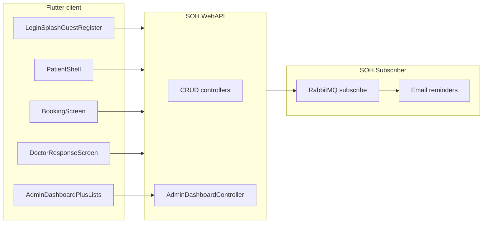

# Analysis: seminar document vs Stomatološka Ordinacija Hercegovina solution

_Source: gap review (excluding online payment)._

**Yes or no — “If I ran the same deep analysis again, would it be the same?”**  
**No.** After the Flutter work on `feat/seminar-requirements-ui`, many rows that were *Missing* or *Partial* are now *Done* or better *Partial*. What stays different is mostly scope the doc mentions but we still skip or only lightly cover (payment, collaborative recommendations, full admin CRUD, storefront/orders UI).

---

## 1. Document (Fakultet Informacijskih Tehnologija (1).docx) — substance

**Genre and purpose:** Seminar paper / theme proposal (“Restorante” header appears to be a template artifact) for **Razvoj softvera II**, dated **July 2024**, student **Haris Tirić**, mentors named. It frames a real problem in BH healthcare (queues, limited slots, weak communication), focuses on **stomatology**, and introduces the product **“Stomatološka Ordinacija Hercegovina”** as a platform for digital access.

**Stated goals:** Online booking, access to findings, visibility of procedures (extraction, check-ups, etc.), better organization, patient–clinic communication, shorter waiting.

**Functional requirements — end users (verbatim themes):**

- View **free appointment slots**; **book and cancel**; view **scheduled** and **historical** appointments.
- **Doctor:** add **findings and professional opinion**; **patient:** view them.
- **Payment via app** (PayPal narrative in mockup) — **out of scope** for gap scoring in this plan.
- **Reviews and ratings** after service.
- **Doctor response** to booking requests: accepted/declined **with notes**.
- **Reminders** for check-ups and **oral hygiene** (mockup: days until next visit, daily brushing habit indicator, list of things to avoid).
- **Recommended oral-care products** (display and admin-side addition implied).

**Functional requirements — administration:** **View** and **edit** data (broad).

**Mockups / UX narrative (non-exhaustive but binding for “intended” product):**

- **Login:** welcome; login required for advanced features; **guest path** to browse **clinic locations only**.
- **Home:** welcome, **recommended products**, **“Zakaži Termin”** CTA, **dentist list** with short bios/ratings.
- **Booking:** pick **dentist**, **date**, then **hour/minute slots** for that day, **service type**, optional note; navigation back to day selection.
- **My appointments:** three lists — **upcoming** (Cancel, Nalazi), **completed** (Ocijeni, Nalazi), **cancelled** (read-only history).
- **Doctor screen:** review requests; accept/reject with context.
- **Rating screen:** visit summary + **stars** + written review.
- **Reminders screen:** rich **preventive/educational** UI as described above.
- **Admin (desktop):** KPIs (active users, doctors, clients, rooms; completed/cancelled counts; **average revenue**; new members in period), **charts** (appointments over time, financial flows, engagement), **quick actions** (add patients, manage all profile types, edit **office info** (locations, hours, contacts), manage appointments, **generate reports**), **recent activity log** with count indicator.
- **Recommendation system (design):** start with **content-based** filtering; later **collaborative** filtering as data grows.

**Data model (document):** Users, Patients, Doctors, Admins, Appointments, Services, Rooms, Reviews, Products, Orders, Reminders, Activity logs, Reports, Payment, Documents (findings, etc.). Note: diagram columns are examples; final DB may have more.

---

## 2. Solution in this repository — architecture and what exists

**Stack:** **ASP.NET Core Web API** (`backend/SOH.WebAPI`) with **EF Core** (`backend/SOH.Services/Database/SOHDbContext.cs`), **AutoMapper**, CRUD controllers for the main entities, plus **AdminDashboardController** (`/admin-dashboard/...`) for aggregated **stats**, **monthly appointments**, **revenue breakdown**, **doctor spotlight**, **recent activity**. **SOH.Subscriber** listens on **RabbitMQ** for **`AppointmentReminderMessage`** and can send **reminder emails** to configured recipients (`backend/SOH.Subscriber/Services/BackgroundWorkerService.cs`) — complements the in-app reminders/hygiene screen.

**Flutter app** (`app/lib`, current seminar-aligned client on **`feat/seminar-requirements-ui`**): Riverpod + OpenAPI (`soh_api`). **Auth & shell:** splash (with patient-profile check), login, **guest** city list, **register**, **complete patient profile**, **patient shell** (bottom nav: home, appointments, care, profile with logout / user edit). **Patient:** `HomeScreen` (welcome, **content-based** product strip, book CTA, dentists), `BookingScreen` (doctor → date → slots → service → confirm), **my appointments** (three tabs, cancel, findings, review), **reminders & hygiene** (next visit text, brushing log via HygieneTracker API, static avoid list), **patient findings** reader. **Doctor:** pending / upcoming / completed, accept–reject with note, medical record / findings on completed visits. **Admin:** dashboard stats/charts/recent activity; **quick actions** open **users** list (add/manage patients & staff via existing user UI), **office locations** (city list), **all appointments** list, **reports** list; settings action is still a placeholder snackbar.

**Backend vs document (excluding payment):** Entity set matches the paper’s list closely (including **Orders**, **Reminders**, **HygieneTrackers**, **ActivityLogs**, **Reports**, **Payments** as data/API). **Payment** remains **CRUD** only (`backend/SOH.WebAPI/Controllers/PaymentController.cs`), not PayPal.

---

## 3. Coverage table (re-audit — excluding online payment)

| Topic | Status |
| --- | --- |
| Guest: clinic locations only | **Done** (`guest_locations_screen.dart`) |
| Registration / complete patient profile | **Done** (`register_screen.dart`, `complete_profile_screen.dart`) |
| Patient shell (navigation after login) | **Done** (`patient_shell_screen.dart`) |
| View free slots + book appointment | **Done** (`booking_screen.dart` + `booking_slots.dart` + providers) |
| Cancel appointment (patient) | **Done** (UI → status cancelled) |
| My appointments (upcoming / completed / cancelled + actions) | **Done** (`my_appointments_screen.dart`) |
| Patient: view findings / documents | **Done** (`patient_findings_screen.dart`) |
| Doctor: add findings + opinion | **Done** |
| Doctor: accept/decline with notes | **Done** |
| Reviews and ratings (patient UI) | **Done** (`appointment_review_screen.dart`) |
| Recommended products (content-based) | **Done** on home; **collaborative** | **Missing** (doc phase 2) |
| Admin: dashboard KPIs + charts + recent activity | **Done** |
| Admin: quick actions wired | **Partial** (navigation + lists; not every mockup action is a full editor) |
| Admin: user management | **Partial** (users list/edit; role-specific “add patient only” flow not separate) |
| Reports from Flutter | **Partial** (list existing reports; no “generate file” wizard) |
| Reminders + hygiene mockup screen | **Done** in app + **Partial** (subscriber email remains env-driven) |
| Orders / product purchase UI | **Partial** (backend; no shop/checkout in Flutter) |
| Activity log vs doc examples (e.g. backup) | **Partial** (real API events; not every mockup line item) |
| Payment in app (PayPal) | **Out of scope** for this document version |

---

## 4. Recommended next steps (residual)

1. **Payment:** only if product scope expands — integrate a real provider or keep CRUD-only payments.
2. **Collaborative recommendations** when enough usage data exists; keep content-based as baseline.
3. **Admin depth:** dedicated “add patient” wizard, edit office hours/contacts beyond city list, report **generation/export** UI, settings screen instead of snackbar.
4. **Patient shop:** optional **orders** UI if the seminar is interpreted as e‑commerce for products.
