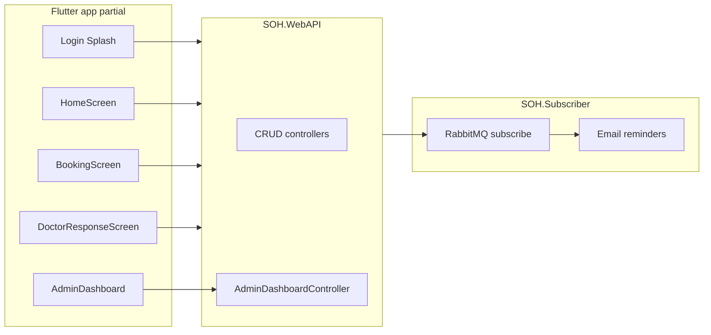

# Analysis: seminar document vs Stomatološka Ordinacija Hercegovina solution

_Source: gap review (excluding online payment)._

**Update (Flutter):** Branch `feat/seminar-requirements-ui` implements the missing client pieces: guest locations, registration, patient shell (home / appointments / care / profile), my appointments (upcoming · completed · cancelled) with cancel, findings, and reviews, reminders & hygiene (next visit + brushing log + avoid list), admin quick actions wired to users, cities, appointments, and reports lists. Online PayPal payment and collaborative recommendation phase remain out of scope unless added later._

## 1. Document (Fakultet Informacijskih Tehnologija (1).docx) — substance

**Genre and purpose:** Seminar paper / theme proposal (“Restorante” header appears to be a template artifact) for **Razvoj softvera II**, dated **July 2024**, student **Haris Tirić**, mentors named. It frames a real problem in BH healthcare (queues, limited slots, weak communication), focuses on **stomatology**, and introduces the product **“Stomatološka Ordinacija Hercegovina”** as a platform for digital access.

**Stated goals:** Online booking, access to findings, visibility of procedures (extraction, check-ups, etc.), better organization, patient–clinic communication, shorter waiting.

**Functional requirements — end users (verbatim themes):**

- View **free appointment slots**; **book and cancel**; view **scheduled** and **historical** appointments.
- **Doctor:** add **findings and professional opinion**; **patient:** view them.
- **Payment via app** (PayPal narrative in mockup) — **out of scope** for gap scoring in this plan.
- **Reviews and ratings** after service.
- **Doctor response** to booking requests: accepted/declined **with notes**.
- **Reminders** for check-ups and **oral hygiene** (mockup: days until next visit, daily brushing habit indicator, list of things to avoid).
- **Recommended oral-care products** (display and admin-side addition implied).

**Functional requirements — administration:** **View** and **edit** data (broad).

**Mockups / UX narrative (non-exhaustive but binding for “intended” product):**

- **Login:** welcome; login required for advanced features; **guest path** to browse **clinic locations only**.
- **Home:** welcome, **recommended products**, **“Zakaži Termin”** CTA, **dentist list** with short bios/ratings.
- **Booking:** pick **dentist**, **date**, then **hour/minute slots** for that day, **service type**, optional note; navigation back to day selection.
- **My appointments:** three lists — **upcoming** (Cancel, Nalazi), **completed** (Ocijeni, Nalazi), **cancelled** (read-only history).
- **Doctor screen:** review requests; accept/reject with context.
- **Rating screen:** visit summary + **stars** + written review.
- **Reminders screen:** rich **preventive/educational** UI as described above.
- **Admin (desktop):** KPIs (active users, doctors, clients, rooms; completed/cancelled counts; **average revenue**; new members in period), **charts** (appointments over time, financial flows, engagement), **quick actions** (add patients, manage all profile types, edit **office info** (locations, hours, contacts), manage appointments, **generate reports**), **recent activity log** with count indicator.
- **Recommendation system (design):** start with **content-based** filtering; later **collaborative** filtering as data grows.

**Data model (document):** Users, Patients, Doctors, Admins, Appointments, Services, Rooms, Reviews, Products, Orders, Reminders, Activity logs, Reports, Payment, Documents (findings, etc.). Note: diagram columns are examples; final DB may have more.

---

## 2. Solution in this repository — architecture and what exists

**Stack:** **ASP.NET Core Web API** (`backend/SOH.WebAPI`) with **EF Core** (`backend/SOH.Services/Database/SOHDbContext.cs`), **AutoMapper**, CRUD controllers for the main entities, plus **AdminDashboardController** (`/admin-dashboard/...`) for aggregated **stats**, **monthly appointments**, **revenue breakdown**, **doctor spotlight**, **recent activity**. **SOH.Subscriber** listens on **RabbitMQ** for **`AppointmentReminderMessage`** and can send **reminder emails** to configured recipients (`backend/SOH.Subscriber/Services/BackgroundWorkerService.cs`) — infrastructure for reminders, not the in-app “hygiene dashboard” from the mockup.

**Flutter app** (`app/lib`): Riverpod + OpenAPI client (`soh_api`). Implemented **screens/widgets** include login, splash, home (welcome, horizontal **recommended products** with **content-based** heuristic in `app/lib/features/patient/presentation/providers/patient_data_providers.dart`), booking wizard (`app/lib/features/booking/presentation/booking_screen.dart`), doctor appointment tabs with **Accept/Reject** and optional note + **findings** flow (`app/lib/features/doctor/presentation/screens/doctor_response_screen.dart`, `doctor_visit_document_screen.dart`), admin dashboard UI with charts and activity (`app/lib/features/admin_dashboard/presentation/screens/admin_dashboard_screen.dart`), user list/edit.

**Critical repo integrity issue (Flutter):** `app/lib/main.dart` imports **`PatientShellScreen`**, **`GuestLocationsScreen`**, **`RegisterScreen`**, **`CompleteProfileScreen`**, and **`booking_screen.dart`** imports **`booking_config.dart`**, **`booking_slots.dart`**, plus **`patient_repository_providers.dart`** — **verify these exist** on your branch; if absent, the **patient shell, guest flow, registration, profile completion, and several core utilities** must be restored or imports rewritten for a buildable client.

**Backend vs document (excluding payment):** Entity set matches the paper’s list closely (including **Orders**, **Reminders**, **HygieneTrackers**, **ActivityLogs**, **Reports**, **Payments** as data/API). **Payment** exists as **CRUD** (`backend/SOH.WebAPI/Controllers/PaymentController.cs`), not PayPal.

---

## 3. Coverage table (simple — excluding online payment)

Rows use **Done** = implemented end-to-end in the analyzed snapshot, **Partial** = API/domain or UI fragment only, **Missing** = not implemented or not present in tree.

| Topic | Status |
| --- | --- |
| Guest: clinic locations only | Missing / verify `GuestLocationsScreen` |
| Registration / complete patient profile | Missing / verify routes in `main.dart` |
| Patient shell (navigation after login) | Missing / verify `PatientShellScreen` |
| View free slots + book appointment | Partial (`booking_screen.dart`; depends on providers/config) |
| Cancel appointment (patient) | Missing in UI; backend has `Cancelled` |
| My appointments (upcoming / completed / cancelled + actions) | Missing in UI |
| Patient: view findings / documents | Partial (API; verify patient UI) |
| Doctor: add findings + opinion | Done |
| Doctor: accept/decline with notes | Done |
| Reviews and ratings (patient UI) | Partial (API layer) |
| Recommended products (content-based) | Partial; collaborative filtering | Missing (phase 2 in doc) |
| Admin: dashboard KPIs + charts + recent activity | Done |
| Admin: quick actions wired | Missing (`quick_actions_card.dart` empty handlers) |
| Admin: user management | Partial |
| Reports from Flutter | Partial (API CRUD exists) |
| Reminders + hygiene mockup screen | Missing in Flutter; partial backend + subscriber |
| Orders / product purchase UI | Partial backend |
| Activity log vs doc examples (e.g. backup) | Partial |

---

## 4. Recommended next steps

1. **Restore or add** missing Dart modules: `patient_repository_providers.dart`, `patient_shell_screen.dart`, auth screens, `core/config/booking_config.dart`, `core/domain/booking_slots.dart`, `core/utils/appointment_labels.dart`, and **`core/widgets`** used by `home_screen.dart` so **`flutter analyze`** passes.
2. Implement **patient appointments** screen matching the mockup (three lists + cancel + records + review).
3. Wire **admin quick actions** to real routes or remove until implemented.
4. Optionally add **Reminders/Hygiene** patient screen backed by existing APIs, or narrow the document promise to “email reminders only.”
